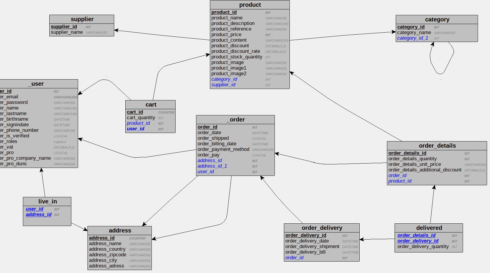
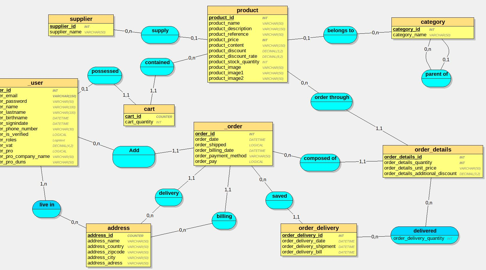

# Dictionnaire de données

## Table user
Codification | Type | Contraintes | Règles
---------|----------| ----------- | -----
 user_id | INT AUTO_INCREMENT PRIMARY KEY
 user_email | VARCHAR(150)
 user_password | VARCHAR(50)
 user_name | VARCHAR(100)
 user_lastname | VARCHAR(100)
 user_birthdate | DATETIME
 user_signupdate | DATETIME
 | |
 user_country | LONGTEXT | | DC2Type:json
 user_adress | VARCHAR(150)
 user_zipcode | VARCHAR(150)
 | |
 user_billing_country | LONGTEXT | | DC2Type:json
 user_billing_adress | VARCHAR(150)
 user_billing_zipcode | VARCHAR(150)
 | |
 user_phonenumber | VARCHAR(30)
 user_isverified | BOOLEAN
 user_roles | LONGTEXT | | DC2Type:json
 user_vat | DECIMAL(4,2) 
 | |
 user_pro | BOOLEAN
 user_pro_company_name | VARCHAR(50) 
 user_pro_duns | VARCHAR(50) | | DUNS = SIRET international (Data universal number system) 


## Table cart
Codification | Type | Contraintes | Règles
---------|----------| ----------- | -----
 cart_id | INT AUTO_INCREMENT | PRIMARY KEY
 user_id | INT REFERENCES user(user_id)
 cart_order_date | DATETIME
 cart_validated | BOOLEAN
 cart_shipped | BOOLEAN
 user_delivery_country | LONGTEXT | | DC2Type:json
 user_delivery_adress | VARCHAR(150)
 user_delivery_zipcode | VARCHAR(150)


## Table order_details
Codification | Type | Contraintes | Règles
---------|----------| ----------- | -----
 orderdetails_id | INT AUTO_INCREMENT | PRIMARY KEY
 product_id | INT REFERENCES product(product_id)
 cart_id | INT REFERENCES cart(cart_id)
 order_delivery_id | INT REFERENCES order_delivery(order_delivery_id)
 orderdetails_quantity | INT
 order_details_unit_price | DOUBLE
 order_optional_discount | DECIMAL(3,2) | | Pour les commerciaux


## Table order_delivery
Codification | Type | Contraintes | Règles
---------|----------| ----------- | -----
 order_delivery_id | INT AUTO_INCREMENT PRIMARY KEY
 order_delivery_shipment_date | DATETIME
 order_delivery_quantity | INT


## Table Product
Codification | Type | Contraintes | Règles
---------|----------| ----------- | -----
 product_id | INT AUTO_INCREMENT PRIMARY KEY
 product_supplier_id | INT REFERENCES supplier(supplier_id)
 product_category_id | INT REFERENCES category(category_id)
 product_name | VARCHAR(50) | | Ne pas oublier la brand dans le nom
 product_image | VARCHAR(50)
 product_description | VARCHAR(150)
 product_price | INT
 product_content | VARCHAR(150)
 product_discount | DECIMAL(3,2)
 product_stock_quantity | INT | > 0 


## Table Supplier
Codification | Type | Contraintes | Règles
---------|----------| ----------- | -----
 supplier_id | INT AUTO_INCREMENT PRIMARY KEY
 supplier_name | VARCHAR(50)

<!-- + adress, Phone, Responsable, SIRET.... -->

<!-- Rajouter une table Brand éventuellement -->


## Table Category
Codification | Type | Contraintes | Règles
---------|----------| ----------- | -----
 category_id | INT AUTO_INCREMENT PRIMARY KEY
 category_parent_id | INT REFERENCES category(category_id)
 category_name | VARCHAR(50)


# MLD
```sql
user = (user_id INT, user_email VARCHAR(150) , user_password VARCHAR(50) , user_roles LONGTEXT, user_name VARCHAR(100) , user_lastname VARCHAR(100) , user_birthdate DATETIME, user_country LONGTEXT, user_address VARCHAR(150) , user_zipcode VARCHAR(150) , user_billing_country LONGTEXT, user_billing_adress VARCHAR(150) , user_billing_zipcode VARCHAR(50) , user_phonenumber VARCHAR(30) , user_signupdate DATETIME, user_isverified BOOLEAN, user_vat DECIMAL(4,2)  , user_pro BOOLEAN, user_pro_company_name VARCHAR(50) , user_pro_duns VARCHAR(50) );

supplier = (supplier_id INT, supplier_name VARCHAR(50) );

category = (category_id INT, category_name VARCHAR(50) , category_image VARCHAR(50) , #category_parent_id*);

cart = (cart_id INT, cart_order_date DATETIME, cart_validated BOOLEAN, cart_shipped BOOLEAN, user_delivery_country LONGTEXT, user_delivery_address VARCHAR(150) , user_delivery_zipcode VARCHAR(150) , #user_id*);

order_delivery = (order_delivery_id INT AUTO_INCREMENT, order_delivery_shipment_date DATETIME, order_delivery_quantity INT);
product = (product_id INT, product_name VARCHAR(50) , product_image VARCHAR(50) , product_description VARCHAR(150) , product_price INT, product_content VARCHAR(150) , product_discount DECIMAL(3,2)  , product_stock_quantity INT, #category_id*, #supplier_id*);

order_details = (order_details_id INT, order_details_quantity INT, order_details_unit_price VARCHAR(50) , order_details_optional_discount DECIMAL(3,2)  , #order_delivery_id*, #cart_id*, #product_id*);
```



# Script SQL
```sql
CREATE TABLE _user(
   user_id INT AUTO_INCREMENT PRIMARY KEY,
   user_email VARCHAR(150),
   user_password VARCHAR(50),
   user_roles LONGTEXT,
   user_name VARCHAR(100),
   user_lastname VARCHAR(100),
   user_birthdate DATETIME,
   user_country LONGTEXT,
   user_address VARCHAR(150),
   user_zipcode VARCHAR(150),
   user_billing_country LONGTEXT,
   user_billing_adress VARCHAR(150),
   user_billing_zipcode VARCHAR(50),
   user_phonenumber VARCHAR(30),
   user_signupdate DATETIME,
   user_isverified BOOLEAN,
   user_vat DECIMAL(4,2) ,
   user_pro BOOLEAN,
   user_pro_company_name VARCHAR(50),
   user_pro_duns VARCHAR(50) 
);

CREATE TABLE supplier(
   supplier_id INT AUTO_INCREMENT PRIMARY KEY,
   supplier_name VARCHAR(50) 
);

CREATE TABLE category(
   category_id INT AUTO_INCREMENT PRIMARY KEY,
   category_parent_id INT REFERENCES category(category_id),
   category_name VARCHAR(50),
   category_image VARCHAR(50)
);

CREATE TABLE cart(
   cart_id INT AUTO_INCREMENT PRIMARY KEY,
   user_id INT REFERENCES _user(user_id),
   cart_order_date DATETIME,
   cart_validated BOOLEAN,
   cart_shipped BOOLEAN,
   user_delivery_country LONGTEXT,
   user_delivery_address VARCHAR(150),
   user_delivery_zipcode VARCHAR(150)
);

CREATE TABLE order_delivery(
   order_delivery_id INT AUTO_INCREMENT PRIMARY KEY,
   order_delivery_shipment_date DATETIME,
   order_delivery_quantity INT
);

CREATE TABLE product(
   product_id INT AUTO_INCREMENT PRIMARY KEY,
   category_id INT REFERENCES category(category_id),
   supplier_id INT REFERENCES supplier(supplier_id),
   product_name VARCHAR(50),
   product_image VARCHAR(50),
   product_description VARCHAR(150),
   product_price INT NOT NULL,
   product_content VARCHAR(150),
   product_discount DECIMAL(3,2),
   product_stock_quantity INT
);

CREATE TABLE order_details(
   order_details_id INT AUTO_INCREMENT PRIMARY KEY,
   order_delivery_id INT REFERENCES order_delivery(order_delivery_id),
   cart_id INT REFERENCES cart(cart_id),
   product_id INT REFERENCES product(product_id),
   order_details_quantity INT NOT NULL,
   order_details_unit_price VARCHAR(50),
   order_details_optional_discount DECIMAL(3,2) 
);
```

# MCD
