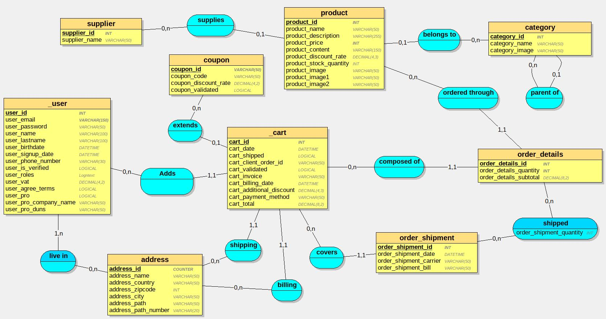
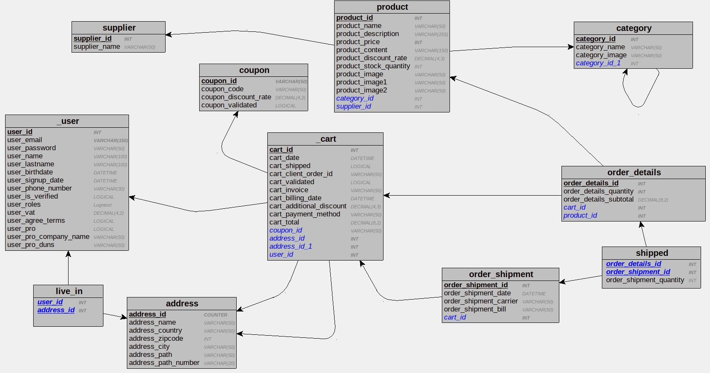
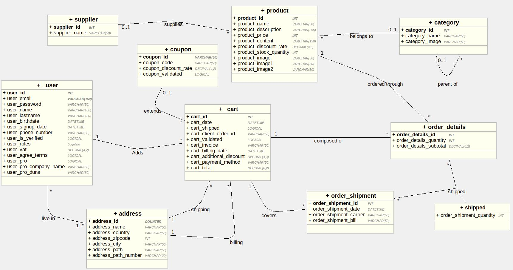

# Dictionnaire de données

## Table user
Codification | Type | Contraintes | Règles
---------|----------| ----------- | -----
 user_id | INT AUTO_INCREMENT PRIMARY KEY
 user_email | VARCHAR(150)
 user_password | VARCHAR(50)
 user_name | VARCHAR(100)
 user_lastname | VARCHAR(100)
 user_birthdate | DATETIME
 user_signupdate | DATETIME
 | |
 user_country | LONGTEXT | | DC2Type:json
 user_adress | VARCHAR(150)
 user_zipcode | VARCHAR(150)
 | |
 user_billing_country | LONGTEXT | | DC2Type:json
 user_billing_adress | VARCHAR(150)
 user_billing_zipcode | VARCHAR(150)
 | |
 user_phonenumber | VARCHAR(30)
 user_isverified | BOOLEAN
 user_roles | LONGTEXT | | DC2Type:json
 user_vat | DECIMAL(4,2) 
 | |
 user_pro | BOOLEAN
 user_pro_company_name | VARCHAR(50) 
 user_pro_duns | VARCHAR(50) | | DUNS = SIRET international (Data universal number system) 


## Table cart
Codification | Type | Contraintes | Règles
---------|----------| ----------- | -----
 cart_id | INT AUTO_INCREMENT | PRIMARY KEY
 user_id | INT REFERENCES user(user_id)
 cart_order_date | DATETIME
 cart_validated | BOOLEAN
 cart_shipped | BOOLEAN
 user_delivery_country | LONGTEXT | | DC2Type:json
 user_delivery_adress | VARCHAR(150)
 user_delivery_zipcode | VARCHAR(150)


## Table order_details
Codification | Type | Contraintes | Règles
---------|----------| ----------- | -----
 orderdetails_id | INT AUTO_INCREMENT | PRIMARY KEY
 product_id | INT REFERENCES product(product_id)
 cart_id | INT REFERENCES cart(cart_id)
 order_delivery_id | INT REFERENCES order_delivery(order_delivery_id)
 orderdetails_quantity | INT
 order_details_unit_price | DOUBLE
 order_optional_discount | DECIMAL(3,2) | | Pour les commerciaux


## Table order_delivery
Codification | Type | Contraintes | Règles
---------|----------| ----------- | -----
 order_delivery_id | INT AUTO_INCREMENT PRIMARY KEY
 order_delivery_shipment_date | DATETIME
 order_delivery_quantity | INT


## Table Product
Codification | Type | Contraintes | Règles
---------|----------| ----------- | -----
 product_id | INT AUTO_INCREMENT PRIMARY KEY
 product_supplier_id | INT REFERENCES supplier(supplier_id)
 product_category_id | INT REFERENCES category(category_id)
 product_name | VARCHAR(50) | | Ne pas oublier la brand dans le nom
 product_image | VARCHAR(50)
 product_description | VARCHAR(150)
 product_price | INT
 product_content | VARCHAR(150)
 product_discount | DECIMAL(3,2)
 product_stock_quantity | INT | > 0 


## Table Supplier
Codification | Type | Contraintes | Règles
---------|----------| ----------- | -----
 supplier_id | INT AUTO_INCREMENT PRIMARY KEY
 supplier_name | VARCHAR(50)

<!-- + adress, Phone, Responsable, SIRET.... -->

<!-- Rajouter une table Brand éventuellement -->


## Table Category
Codification | Type | Contraintes | Règles
---------|----------| ----------- | -----
 category_id | INT AUTO_INCREMENT PRIMARY KEY
 category_parent_id | INT REFERENCES category(category_id)
 category_name | VARCHAR(50)


# MCD



# MLD Textuel
```sql
user = (user_id INT, user_email VARCHAR(150), user_password VARCHAR(50), user_name VARCHAR(100), user_lastname VARCHAR(100), user_birthname DATETIME, user_signindate DATETIME, user_phone_number VARCHAR(30), user_is_verified LOGICAL, user_roles Logntext , user_vat DECIMAL(4,2), user_agree_terms LOGICAL, user_pro LOGICAL, user_pro_company_name VARCHAR(50), user_pro_duns VARCHAR(50));
supplier = (supplier_id INT, supplier_name VARCHAR(50));
category = (category_id INT, category_name VARCHAR(50), category_image VARCHAR(50), #category_id_1*);
address = (address_id COUNTER, address_name VARCHAR(50), address_country VARCHAR(50), address_zipcode VARCHAR(50), address_city VARCHAR(50), address_path VARCHAR(50), address_path_number VARCHAR(50));
coupon = (coupon_id VARCHAR(50), coupon_code VARCHAR(50), coupon_discount_rate DECIMAL(4,2), coupon_validated LOGICAL);
product = (product_id INT, product_name VARCHAR(50), product_description VARCHAR(150), product_reference VARCHAR(50), product_price INT, product_content VARCHAR(150), product_discount_rate DECIMAL(4,3), product_stock_quantity INT, product_image VARCHAR(50), product_image1 VARCHAR(50), product_image2 VARCHAR(50), #category_id*, #supplier_id*);
cart = (cart_id INT, cart_date DATETIME, cart_shipped LOGICAL, cart_client_order_id VARCHAR(50), cart_validated LOGICAL, cart_invoice VARCHAR(50), cart_billing_date DATETIME, cart_additional_discount DECIMAL(4,3), cart_payment_method VARCHAR(50), cart_pay LOGICAL, cart_total DECIMAL(8,2), #coupon_id*, #address_id, #address_id_1, #user_id);
order_details = (order_details_id INT, order_details_quantity INT, order_details_subtotal DECIMAL(8,2), #cart_id, #product_id);
order_shipment = (order_shipment_id INT, order_shipment_date DATETIME, order_shipment_carrier VARCHAR(50), order_shipment_bill VARCHAR(50), #cart_id);
live_in = (#user_id, #address_id);
shipped = (#order_details_id, #order_shipment_id, order_shipment_quantity INT);
```
# MLD Graphique


# UML



# Script SQL
```sql
CREATE TABLE user(
   user_id INT,
   user_email VARCHAR(150) NOT NULL,
   user_password VARCHAR(50),
   user_name VARCHAR(100),
   user_lastname VARCHAR(100),
   user_birthname DATETIME,
   user_signindate DATETIME,
   user_phone_number VARCHAR(30),
   user_is_verified LOGICAL,
   user_roles Logntext ,
   user_vat DECIMAL(4,2),
   user_agree_terms LOGICAL,
   user_pro LOGICAL,
   user_pro_company_name VARCHAR(50),
   user_pro_duns VARCHAR(50),
   PRIMARY KEY(user_id)
);

CREATE TABLE supplier(
   supplier_id INT,
   supplier_name VARCHAR(50),
   PRIMARY KEY(supplier_id)
);

CREATE TABLE category(
   category_id INT,
   category_name VARCHAR(50),
   category_image VARCHAR(50),
   category_id_1 INT,
   PRIMARY KEY(category_id),
   FOREIGN KEY(category_id_1) REFERENCES category(category_id)
);

CREATE TABLE address(
   address_id COUNTER,
   address_name VARCHAR(50),
   address_country VARCHAR(50),
   address_zipcode VARCHAR(50),
   address_city VARCHAR(50),
   address_path VARCHAR(50),
   address_path_number VARCHAR(50),
   PRIMARY KEY(address_id)
);

CREATE TABLE coupon(
   coupon_id VARCHAR(50),
   coupon_code VARCHAR(50),
   coupon_discount_rate DECIMAL(4,2),
   coupon_validated LOGICAL,
   PRIMARY KEY(coupon_id)
);

CREATE TABLE product(
   product_id INT,
   product_name VARCHAR(50),
   product_description VARCHAR(150),
   product_reference VARCHAR(50),
   product_price INT NOT NULL,
   product_content VARCHAR(150),
   product_discount_rate DECIMAL(4,3),
   product_stock_quantity INT,
   product_image VARCHAR(50),
   product_image1 VARCHAR(50),
   product_image2 VARCHAR(50),
   category_id INT,
   supplier_id INT,
   PRIMARY KEY(product_id),
   FOREIGN KEY(category_id) REFERENCES category(category_id),
   FOREIGN KEY(supplier_id) REFERENCES supplier(supplier_id)
);

CREATE TABLE cart(
   cart_id INT,
   cart_date DATETIME,
   cart_shipped LOGICAL,
   cart_client_order_id VARCHAR(50),
   cart_validated LOGICAL,
   cart_invoice VARCHAR(50),
   cart_billing_date DATETIME,
   cart_additional_discount DECIMAL(4,3),
   cart_payment_method VARCHAR(50),
   cart_pay LOGICAL,
   cart_total DECIMAL(8,2),
   coupon_id VARCHAR(50),
   address_id INT NOT NULL,
   address_id_1 INT NOT NULL,
   user_id INT NOT NULL,
   PRIMARY KEY(cart_id),
   FOREIGN KEY(coupon_id) REFERENCES coupon(coupon_id),
   FOREIGN KEY(address_id) REFERENCES address(address_id),
   FOREIGN KEY(address_id_1) REFERENCES address(address_id),
   FOREIGN KEY(user_id) REFERENCES _user(user_id)
);

CREATE TABLE order_details(
   order_details_id INT,
   order_details_quantity INT NOT NULL,
   order_details_subtotal DECIMAL(8,2),
   cart_id INT NOT NULL,
   product_id INT NOT NULL,
   PRIMARY KEY(order_details_id),
   FOREIGN KEY(cart_id) REFERENCES _cart(cart_id),
   FOREIGN KEY(product_id) REFERENCES product(product_id)
);

CREATE TABLE order_shipment(
   order_shipment_id INT,
   order_shipment_date DATETIME,
   order_shipment_carrier VARCHAR(50),
   order_shipment_bill VARCHAR(50),
   cart_id INT NOT NULL,
   PRIMARY KEY(order_shipment_id),
   FOREIGN KEY(cart_id) REFERENCES _cart(cart_id)
);

CREATE TABLE live_in(
   user_id INT,
   address_id INT,
   PRIMARY KEY(user_id, address_id),
   FOREIGN KEY(user_id) REFERENCES _user(user_id),
   FOREIGN KEY(address_id) REFERENCES address(address_id)
);

CREATE TABLE shipped(
   order_details_id INT,
   order_shipment_id INT,
   order_shipment_quantity INT,
   PRIMARY KEY(order_details_id, order_shipment_id),
   FOREIGN KEY(order_details_id) REFERENCES order_details(order_details_id),
   FOREIGN KEY(order_shipment_id) REFERENCES order_shipment(order_shipment_id)
);

```

